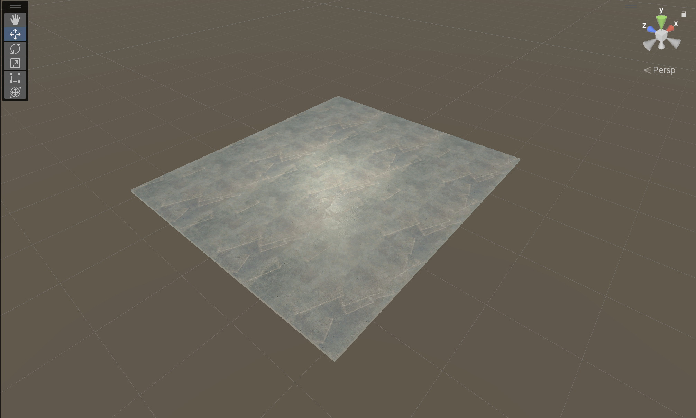
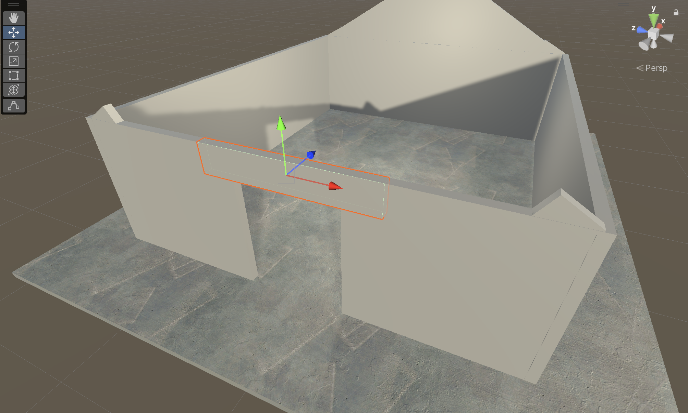
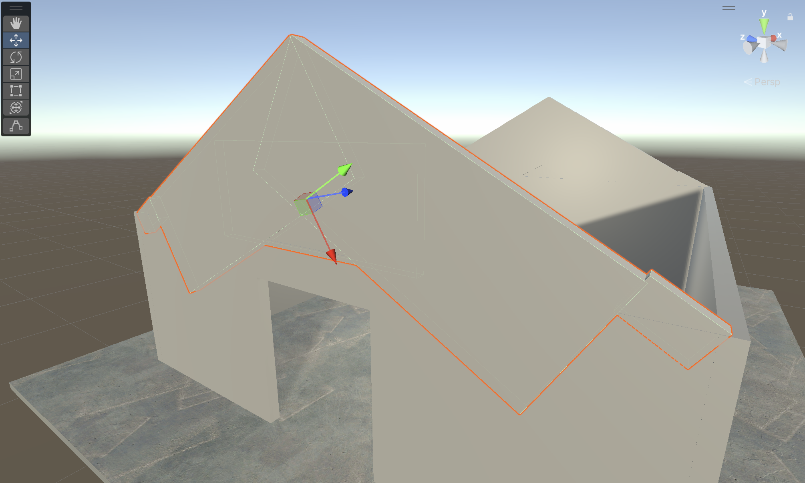
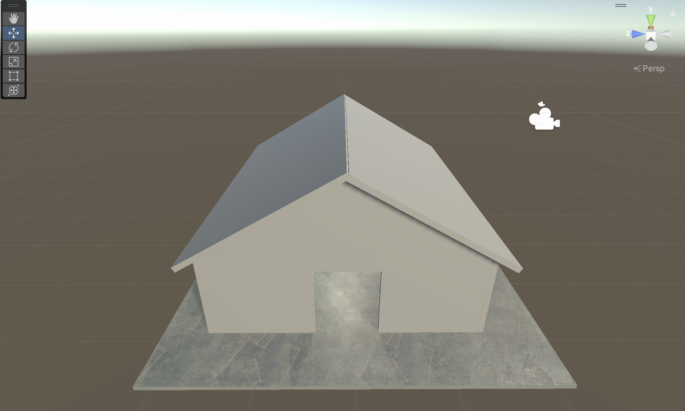

# IUPI Game Devs

Authors: Edward Garcia, Bryan Guevara, Luis Velázquez

We first started with a floor using a 3D object, we chose the cube. By using the scaling function we were able to make the hight of the cube very small and the length and width was almost the same.
After this we went to create the wall of the house. We choose again the cube 3D object and made it so that the hight and the length were more of a rectangle. The width of the wall was smaller. After creating one we made it so we can copy and paste to create two more. When it went time to create a door entrence we decided to make it from three cubes 3D objectsAfter creating the door entrence we chose to create the upper part of the house between the walls and the roof. Here we took some liberties and rotated the scaled and positioned cubes in a way that made sure it covered the area. 
 Finally we took one cube 3D object to create a roof. We were trying out different angles and chose 60° angle as an appropriate angle to match the aesthetic of the house. Once one was created we copy and paste and change the angle to -60°.  

### Things we found interesting

Something we found interesting is that the process of moving and creating the element was much easier than I thought. The different ways of manipulating the shapes are also very useful. The limitation of only using cube as the only 3D object is the only thing we found to be hard because of the gap that existed in between the wall and the roof. Other things we could have tried was adding furniture inside. But knowing the time constraints given we think this was a good work 